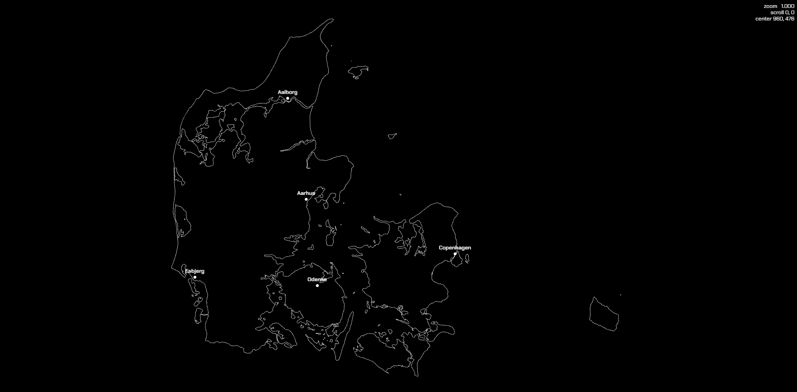

# Sector-North

A browser game set on a real map of Denmark, built with [Phaser 4](https://phaser.io/),
[Vite](https://vitejs.dev/), and TypeScript.



## Vision

> 🚧 Work in progress — the game concept is still being fleshed out. The short version:
> an *Air Defender*–style game played over a real, GPS-accurate map of Denmark. A fuller
> vision statement will land here soon.

## Getting started

### Prerequisites

- [Node.js](https://nodejs.org/) (a current LTS or newer)
- [pnpm](https://pnpm.io/) — this repo is a pnpm workspace; **always use `pnpm`, never
  `npm` or `yarn`** (see `CLAUDE.md` for the project rules)

If you have Node but not pnpm:

```bash
corepack enable pnpm
```

### Run the game locally

From the repo root:

```bash
# Install all workspace dependencies
pnpm install

# Start the dev server (Vite, with hot reload)
pnpm dev
```

Then open the URL Vite prints (typically `http://localhost:5173`). You should see the
Danish coastline (with its neighbouring countries) plus city, airport, and radar-site
markers — scroll to zoom (anchored under the cursor), and pan by click-dragging or with
WASD / arrow keys.

### Other useful commands

```bash
pnpm build       # Type-check and build the game app
pnpm build:all   # Build every app/package in the workspace
pnpm typecheck   # Type-check the whole workspace
```

To target a single app directly, use pnpm filters, e.g.
`pnpm --filter sector-north-game dev`.

## Project layout

```
Sector-North/
├─ apps/
│  └─ game/                # The Phaser + Vite game app
│     ├─ src/map/          # World data loading + the projection layer (no Phaser)
│     ├─ src/game/         # Phaser scenes, layers, camera, HUD
│     ├─ src/data/         # Bundled map data (country boundaries, cities, airports, radars)
│     └─ CLAUDE.md         # App-level architecture rules
├─ docs/                   # Repo documentation assets (screenshots, etc.)
├─ CLAUDE.md               # Project-wide rules (architecture, tooling, style)
├─ pnpm-workspace.yaml     # Workspace definition
└─ package.json            # Root scripts (dev/build/typecheck)
```

## Contributing

Before writing code, read the two rule files — they are short and non-negotiable:

- **`CLAUDE.md`** (repo root) — the core architectural principle (*GPS is the source of
  truth*: the world model lives in real lat/lon and real units; pixels are derived by a
  single projection layer), plus tooling and style rules (fail fast — no fallbacks,
  newest package versions, pnpm only, HUD in white/black only).
- **`apps/game/CLAUDE.md`** — how the game app is structured: the `src/map` / `src/game`
  boundary, the projection layer's contract, and the scene/layer/camera conventions.

They are written for Claude Code but apply equally to human contributors.
